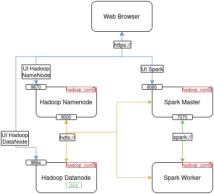
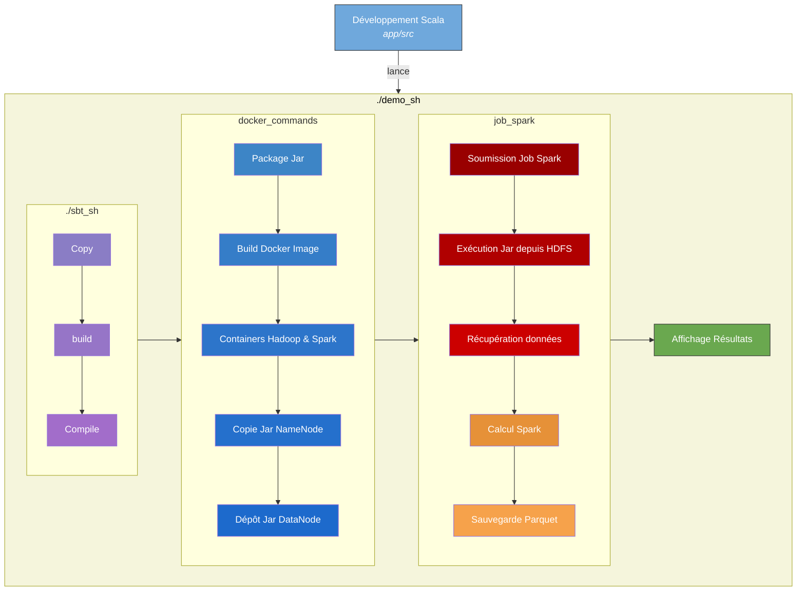

# Big Data Playground

Le projet propose un **environnement de développement** complet pour aborder les technologies Big Data, en s’appuyant sur Spark, Scala et Hadoop (HDFS). Il facilite la **prise en main** du développement en Scala ainsi que la **mise en place** d’un cluster Hadoop et Spark, afin de **comprendre** ces concepts, de les expérimenter et d’observer leur fonctionnement concret.

🚀 **DEMO** → [demo video](#résultat)

Rappelons rapidement les **technologies**:
- **Hadoop** : Projet open source qui fournit un ensemble de frameworks Big Data
- **HDFS** : Hadoop Distributed File System, un système de fichiers distribué
- **Spark** : Framework de traitement de données distribuées
- **Scala** : Langage de programmation
- **SBT** : Simple Build Tool, un outil de build pour Scala
- **Maven** : Outil de build pour Java

## Table des matières
- [Big Data Playground](#big-data-playground)
  - [Table des matières](#table-des-matières)
  - [Code Scala](#code-scala)
    - [Utilisation du Toolkit Docker](#utilisation-du-toolkit-docker)
      - [Configuration](#configuration)
  - [Hadoop \& Spark](#hadoop--spark)
    - [Architecture](#architecture)
    - [Lancement manuel](#lancement-manuel)
- [Demo](#demo)
  - [Déroulement de la démo](#déroulement-de-la-démo)
  - [Résultat](#résultat)
  - [Commandes utiles](#commandes-utiles)
- [Refs](#refs)
- [Repos source](#repos-source)

---

## Code Scala

Dans le dossier `app`, vous trouverez le code source de l’application Scala.

Pour **tester le package**, vous pouvez modifier le fichier
`app/src/main/scala/demo/demoMain.scala`
puis lancer la commande :
```bash
sbt run
```
depuis le **dossier racine du projet**.

Si vous souhaitez **changer la classe d’entrée par défaut**, éditez le fichier `build.sbt` et modifiez la ligne suivante :
```scala
mainClass in (Compile, run) := Some("demo.demoMain")
```

---

### Utilisation du Toolkit Docker

Le projet propose un **toolkit** permettant de lancer le code Scala/Spark sans installer localement Java, Scala, SBT ni Spark.

> **Note** : Vous aurez besoin d’un compte Docker pour accéder au Hub Docker et, si nécessaire, y pousser vos images. Les identifiants sont configurés dans le fichier `.env` (non versionné par git), situé dans le dossier `toolkit`.

#### Configuration

1. Dans le dossier `toolkit/`, créez un fichier `.env` ressemblant à :
   ```
    DOCKER_USER=xxxxxxxx
    DOCKER_PASS=xxxxxxxxxxxx
    JAVA_VERSION=11.0.14.1
    SBT_VERSION=1.6.2
    SCALA_VERSION=2.12.15
   ```
   - Ajustez les versions par défaut de Java, Scala et SBT si besoin.

2. Rendez le script `sbt.sh` exécutable :
   ```bash
   chmod +x sbt.sh
   ```

---

## Hadoop & Spark

L’architecture du projet est basée sur un cluster Hadoop et Spark, composé de **4 conteneurs** :
- `hadoop-namenode` : le nœud maître HDFS
- `hadoop-datanode` : le nœud esclave HDFS
- `spark-master` : le nœud maître Spark
- `spark-worker` : le nœud esclave Spark

Le lancement se fait via `docker-compose` en **utilisant** des images Docker officielles. Les références vers ces images se trouvent dans la section [Refs](#refs).

Une configuration de base est fournie dans le dossier `hadoop_conf/`, partagé par Hadoop et Spark.

### Architecture



### Lancement manuel

```bash
cd hadoop-spark
docker-compose up
```

Vous pouvez alors accéder aux interfaces web suivantes :

- **UI Hadoop NameNode** : http://localhost:9870
- **UI Hadoop DataNode** : http://localhost:9864 (ne fonctionne que si vous avez ajouté `hadoop-datanode` à `/etc/hosts`)
- **UI Spark Master** : http://localhost:8080
- **UI Spark Worker** : http://localhost:8081

> **Note** : Ajoutez `hadoop-datanode 127.0.0.1` dans votre fichier `/etc/hosts` pour accéder à l’interface web du DataNode (utile pour télécharger les fichiers depuis le DataNode).

---

# Demo

La démo illustre un **exemple simple** de traitement de données avec Spark. Elle consiste à lire un fichier CSV, à effectuer un traitement basique et à sauvegarder le résultat au format Parquet.

Pour lancer la démo, exécutez le script `demo.sh` à la racine du projet :

```bash
./demo.sh --rm  # pour supprimer les conteneurs après
```

Vous pouvez aussi afficher l’aide :

```bash
./demo.sh help
```
```bash
help() {
    echo "Usage: $0 [--rm]"
    echo "  --rm: Remove the containers after execution."
    echo "  --force-recreate: Force recreate the containers."
    exit 1
}
```

## Déroulement de la démo

Le schéma ci-dessous illustre les grandes étapes :



## Résultat


## Commandes utiles
```bash
# Lancer le cluster hadoop & spark
cd hadoop-spark
docker-compose up

# Construire le JAR
cd..
source toolkit/.env
./toolkit/sbt.sh package JAVA_VERSION=$JAVA_VERSION SBT_VERSION=$SBT_VERSION SCALA_VERSION=$SCALA_VERSION

# Copier le JAR dans le conteneur hadoop-namenode
docker cp ./toolkit/target/scala-2.12/demo_recette_2.12-0.1.jar hadoop-namenode:/opt/hadoop/data/nameNode/demo_recette_2.12-0.1.jar

# Créer le répertoire /user/spark/jars et copier le JAR dans le conteneur spark-master
docker exec -it hadoop-namenode bash -c "hdfs dfs -mkdir -p /user/spark/jars"


# Copier le JAR dans HDFS
docker exec -it hadoop-namenode bash -c "hdfs dfs -put /opt/hadoop/data/nameNode/demo_recette_2.12-0.1.jar /user/spark/jars"

# Soumettre le job spark (exécuter le JAR)
docker exec -it spark-master bash -c "spark-submit --class demo.demoMain --master spark://spark-master:7077 hdfs://hadoop-namenode:9000/user/spark/jars/demo_recette_2.12-0.1.jar"

# Afficher les résultats
docker exec -it hadoop-namenode bash -c "hdfs dfs -ls -R /user/spark/demo.demoMain"

# Arrêter les conteneurs
cd hadoop-spark
docker-compose down -v
```

---

# Refs

- **Hadoop**
  - [bigdatafoundation/docker-hadoop](https://github.com/bigdatafoundation/docker-hadoop)
  - [Article Medium sur la configuration d’un cluster HDFS Docker](https://bytemedirk.medium.com/setting-up-an-hdfs-cluster-with-docker-compose-a-step-by-step-guide-4541cd15b168)

- **Spark**
  - [Image Docker Bitnami Spark](https://hub.docker.com/r/bitnami/spark/tags)
  - [GitHub Bitnami Spark](https://github.com/bitnami/containers/tree/main/bitnami/spark)
  - <https://github.com/tshine73/docker-spark-cluster/tree/master/>
  - <https://github.com/mvillarrealb/docker-spark-cluster/tree/master>

- **Scala et SBT**
  - [Docker SBT](https://hub.docker.com/r/sbtscala/scala-sbt)
  - [GitHub Docker SBT](https://github.com/sbt/docker-sbt)

- **Maven Repository**
  - [mvnrepository.com](https://mvnrepository.com/)

---

# Repos source

Base : https://github.com/gwendalauphan/big-data-playground.git
